# TOC

- Why Power BI

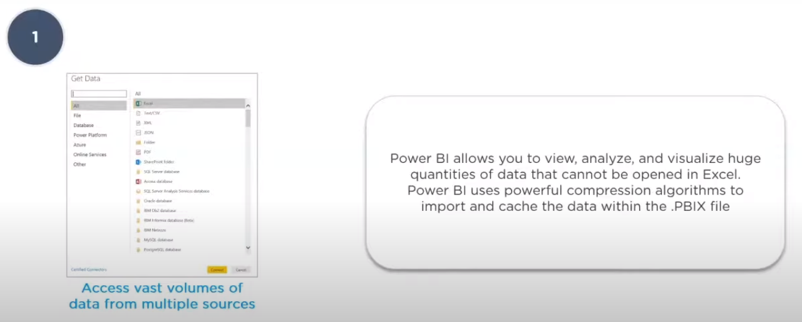

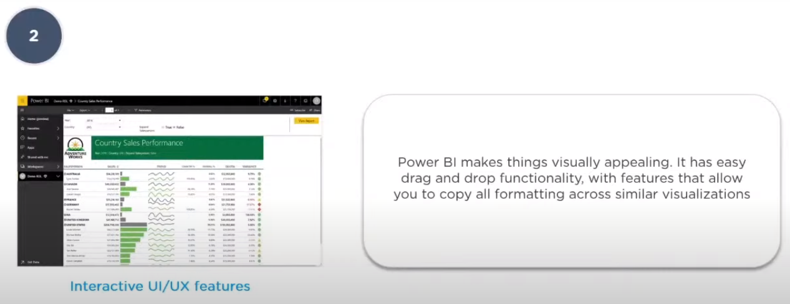

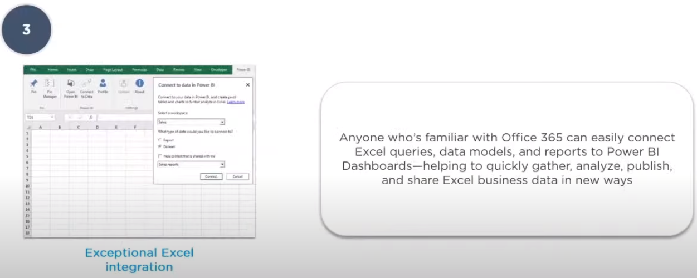

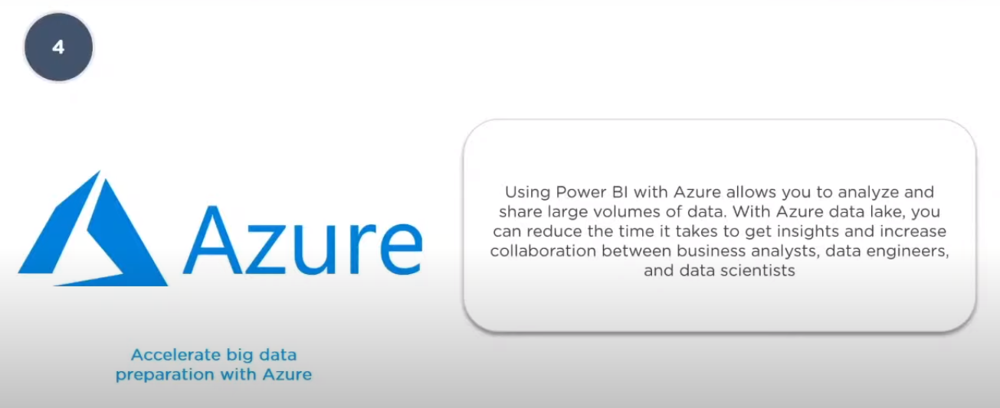

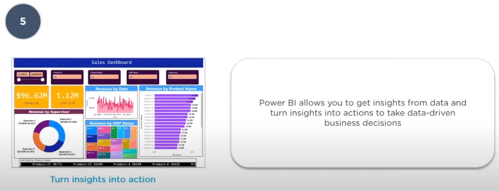

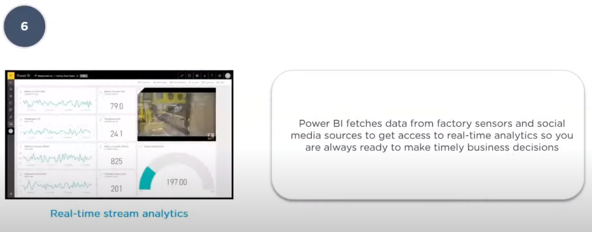

- What is Power BI

- Features of Power BI

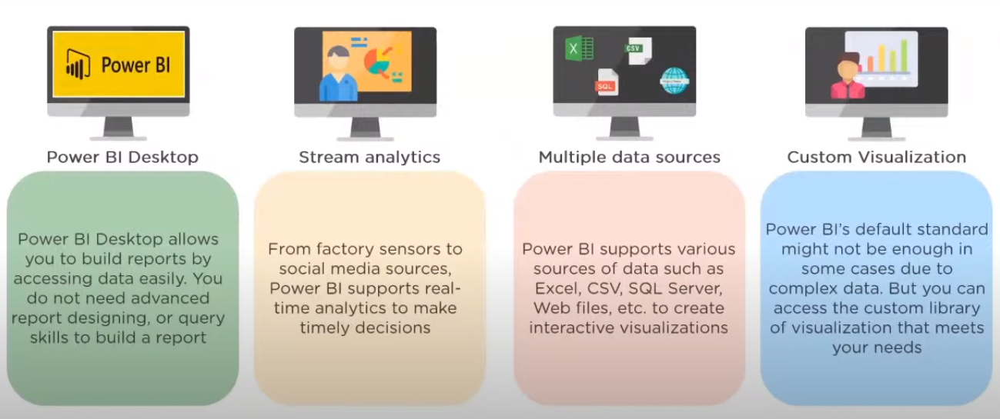

- Components of Power BI

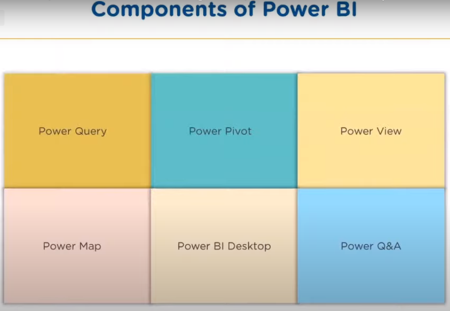

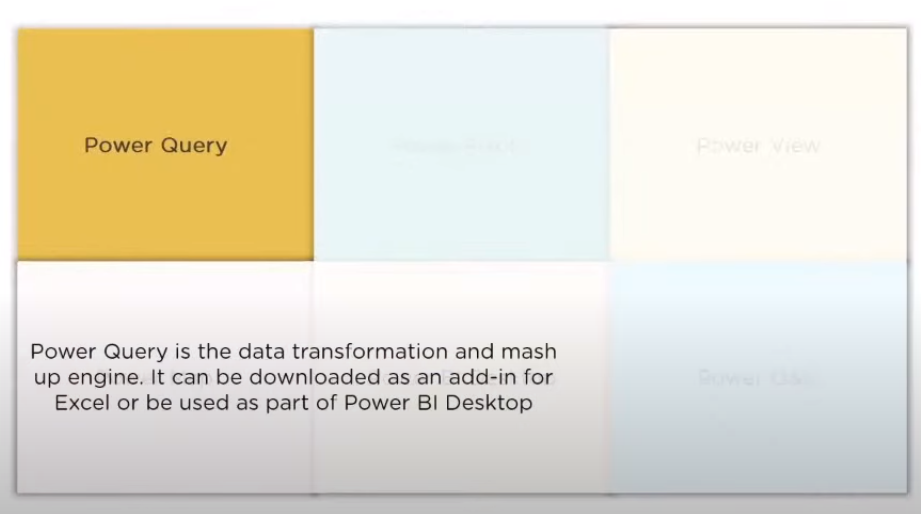

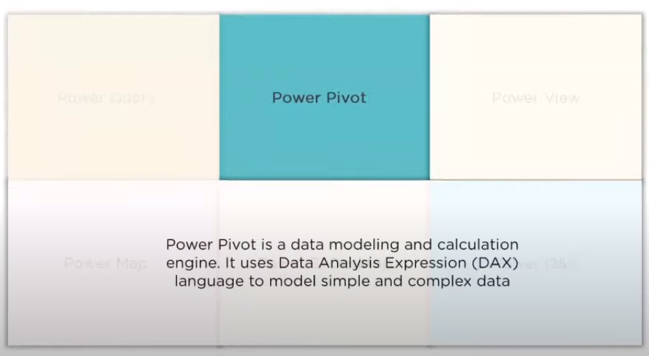

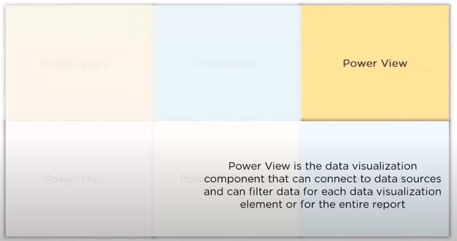

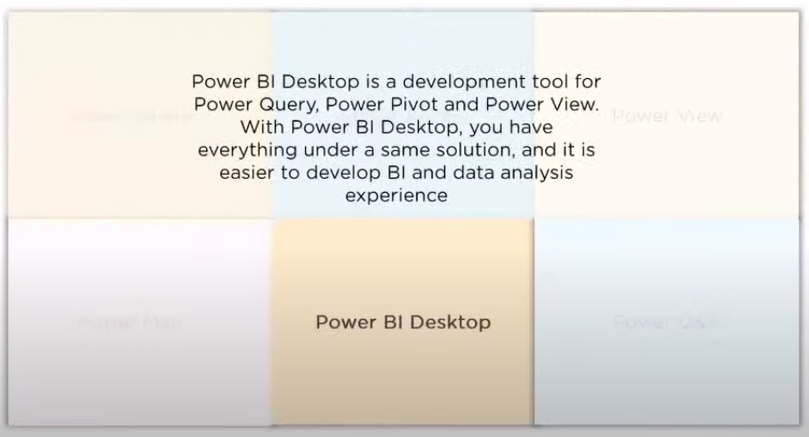

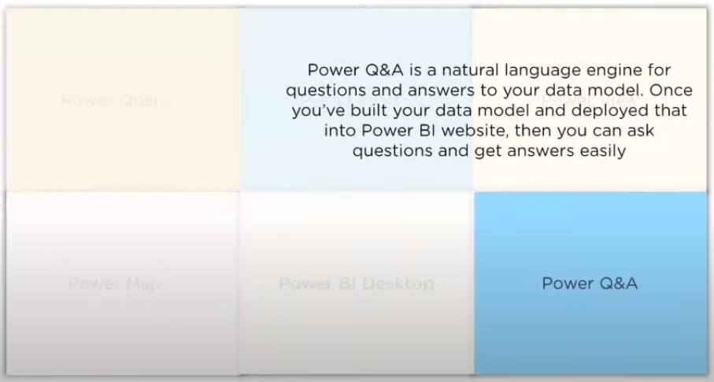

- Power BI service

[power bi service](https://app.powerbi.com/)

Power Bi service is server give you the power bi's service but online 

- Power BI Dashboard

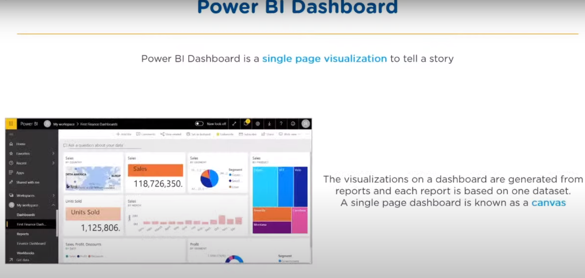

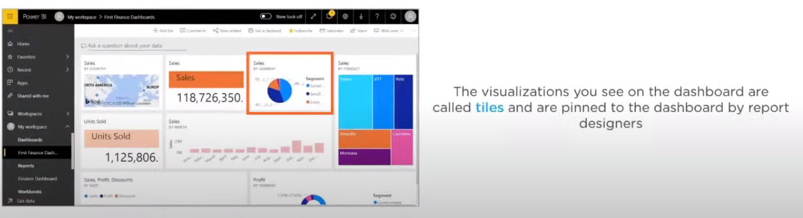

- Architecture of Power BI

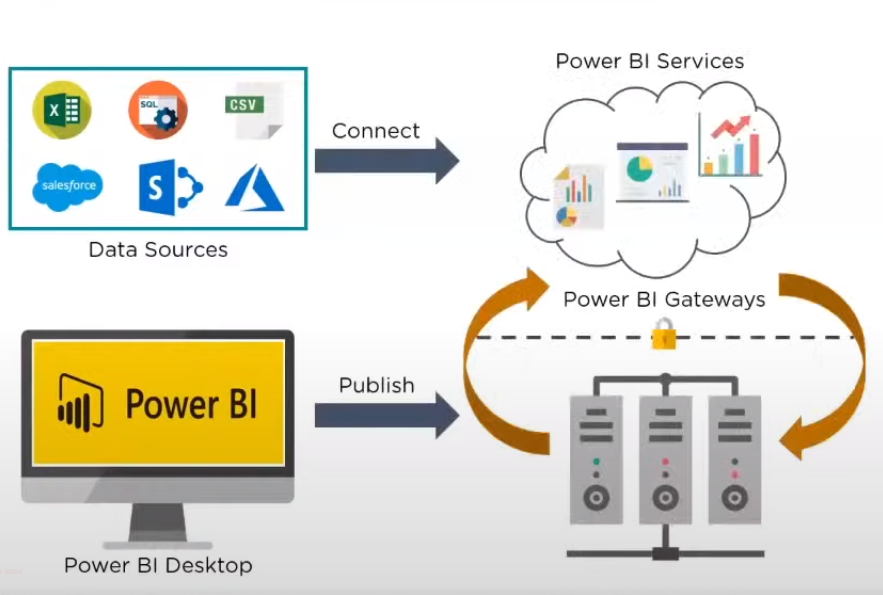

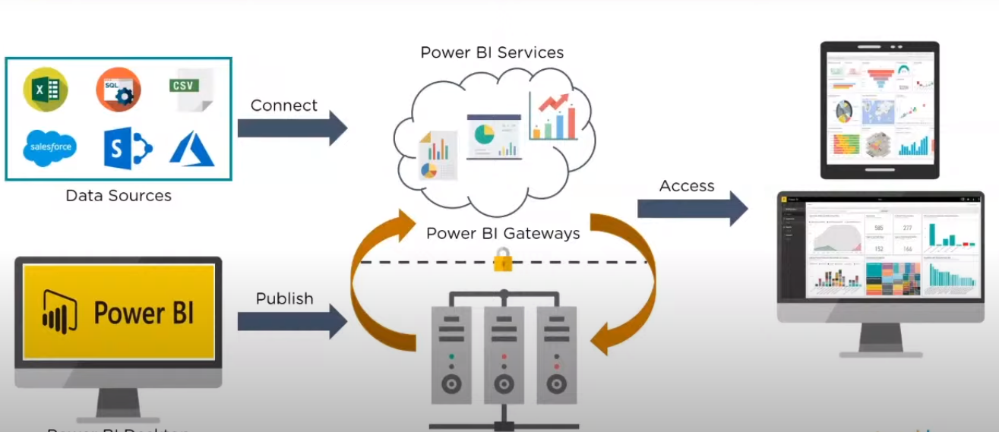

- Power BI case studty