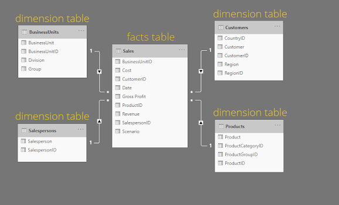
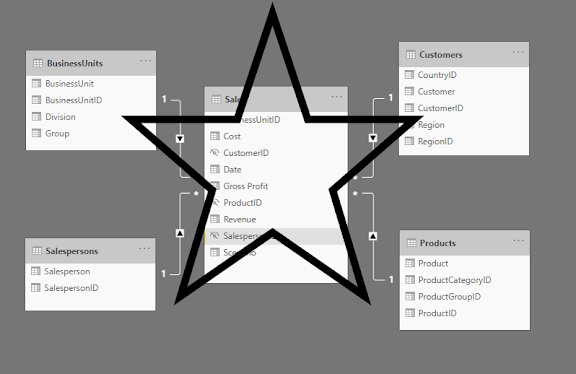
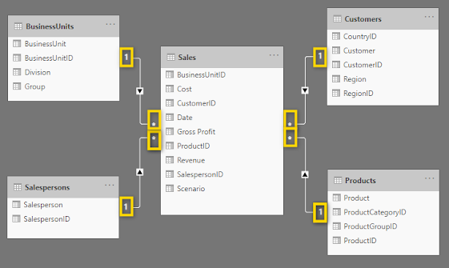

# Star schema

**Dimension table and facts table**

- Fact table: id will appear one or multiple time

- Dimension table: allow 1 id appear 1 time

The relationship between fact table and dimension is `many to one`
