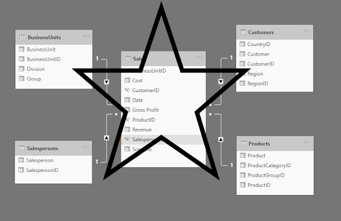
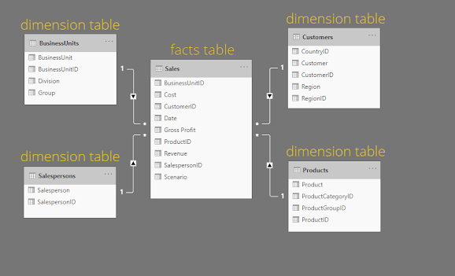
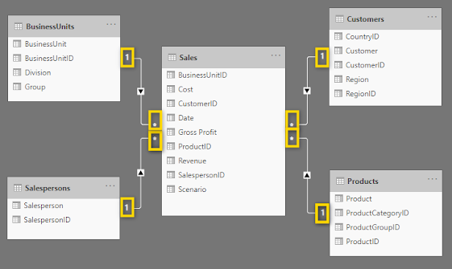

# Star schema

Star structure

Dimension table and fact table

- Dimension table as a sub table, which one id correcspond to only one value.

- Fact id allow one id appear many time.

**One to many**

