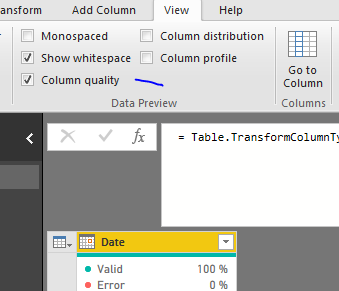
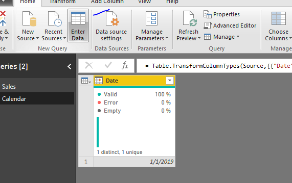
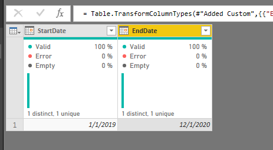
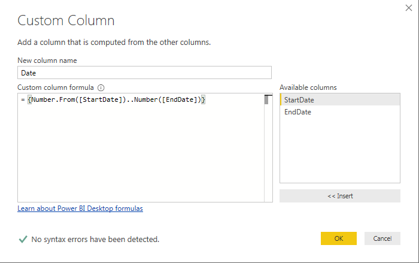
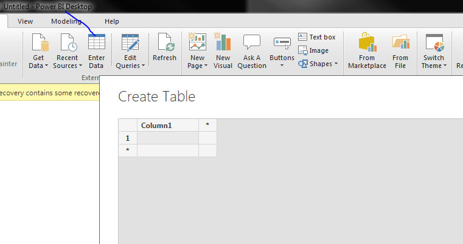
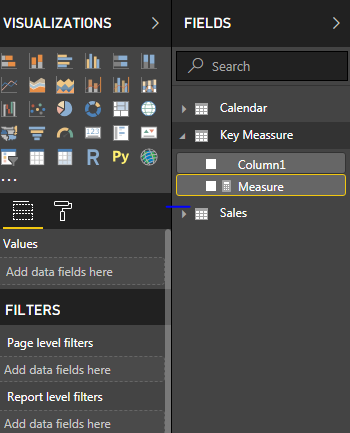
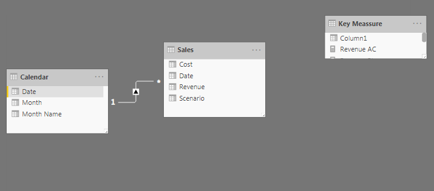

# Base measure

Create a calendar table:

    Calendar = ADDCOLUMNS(CALENDARAUTO(),
    "Year", YEAR([Date]),
    "Month number", MONTH([Date]),
    "Month name", FORMAT([Date],"MMM"))

AC = Actuals

PL = Plan

FC = Forecast

PY = Previous Year

YTD = Year-to-date

-  `Revenue AC = CALCULATE(SUM(Sales[Revenue]),filter(Sales,Sales[Scenario]="AC"))`

- `Revenue PL = calculate(SUM(Sales[Revenue]),FILTER(Sales,Sales[Scenario]="PL"))`

- `Revenue PY = CALCULATE([Revenue AC],DATEADD('Calendar'[Date],-1,YEAR))`

- `Revenues AC YTD = CALCULATE([Revenue AC], DATESYTD('Calendar'[Date]))`

- `Revenues PL YTD = CALCULATE([Revenue PL], DATESYTD('Calendar'[Date]))`

- `Revenues PY YTD = CALCULATE([Revenue PY], DATESYTD('Calendar'[Date]))`

