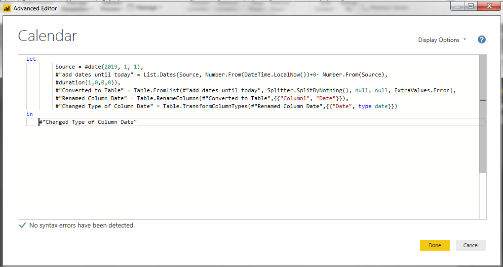
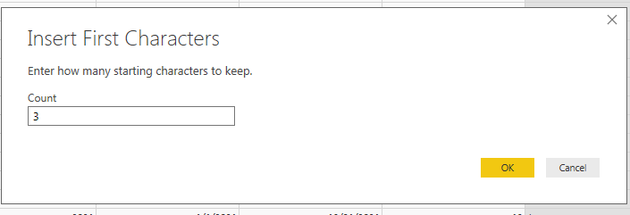
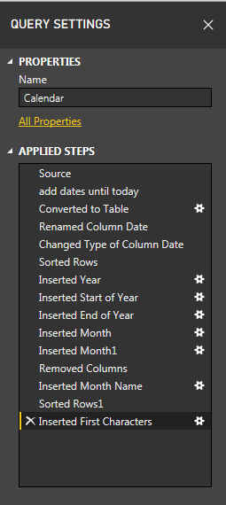
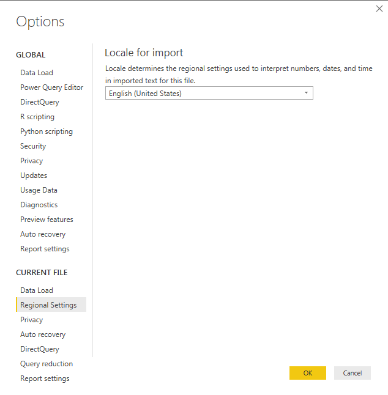
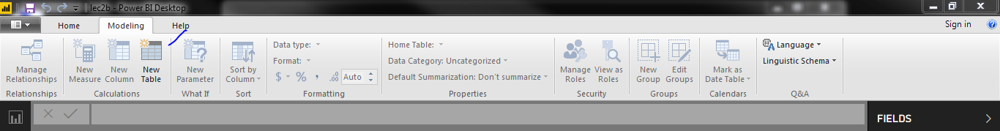
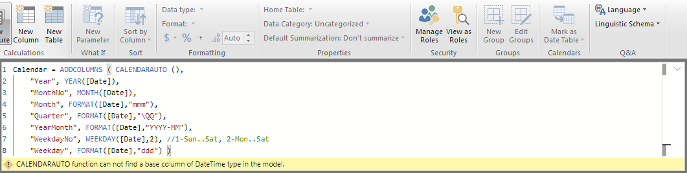
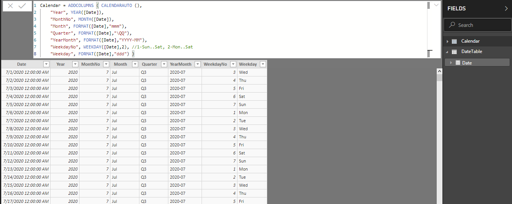
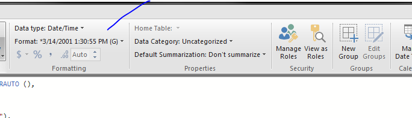
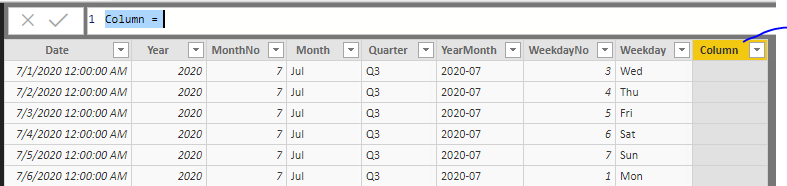

# 1.2 Calendar table

Use blank query for creating a calender table

## M-language

    let
    	 Source = #date(2019, 1, 1),
    	 #"add dates until today" = List.Dates(Source, Number.From(DateTime.LocalNow())+0- Number.From(Source), #duration(1,0,0,0)),
    	 #"Converted to Table" = Table.FromList(#"add dates until today", Splitter.SplitByNothing(), null, null, ExtraValues.Error),
    	 #"Renamed Column Date" = Table.RenameColumns(#"Converted to Table",{{"Column1", "Date"}}),
    	 #"Changed Type of Column Date" = Table.TransformColumnTypes(#"Renamed Column Date",{{"Date", type date}})
    in
    	 #"Changed Type of Column Date"

Modify it, add 1 more year

    let
       Source = #date(2019, 1, 1),
       #"add dates until today" = List.Dates(Source, Number.From(DateTime.LocalNow())+365- Number.From(Source), #duration(1,0,0,0)),
       #"Converted to Table" = Table.FromList(#"add dates until today", Splitter.SplitByNothing(), null, null, ExtraValues.Error),
       #"Renamed Column Date" = Table.RenameColumns(#"Converted to Table",{{"Column1", "Date"}}),
       #"Changed Type of Column Date" = Table.TransformColumnTypes(#"Renamed Column Date",{{"Date", type date}})
    in
       #"Changed Type of Column Date"

## Dax

Our data start from 1 Jul 2018 to 30 Jul 2019, when you apply `Dax`

+ `CALENDAAUTO()`: will return from `1 Jan 2018` to `31 Dec 2019`
+ `CALENDAAUTO(3)`: will return from `1 Mar 2018` to `29 Feb 2019`

      Calendar = ADDCOLUMNS ( CALENDARAUTO (),
      "Year", YEAR([Date]),
      "MonthNo", MONTH([Date]),
      "Month", FORMAT([Date],"mmm"),
      "Quarter", FORMAT([Date],"\QQ"),
      "YearMonth", FORMAT([Date],"YYYY-MM"),
      "WeekdayNo", WEEKDAY([Date],2), //1-Sun..Sat, 2-Mon..Sat
      "Weekday", FORMAT([Date],"ddd") )

Modify new column `WeekDay2 = FORMAT(WEEKDAY(Calendar[Date]),"DDDD")`

CALENDARAUTO function can not find a base column of DateTime type in the model.
https://debug.to/899/calendarauto-function-can-not-find-a-base-column-of-datetime-type-in-the-model

